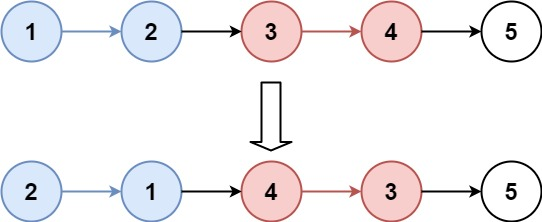

# [25. K 个一组翻转链表](https://leetcode.cn/problems/reverse-nodes-in-k-group/)

给你链表的头节点 `head` ，每 `k` 个节点一组进行翻转，请你返回修改后的链表。

`k` 是一个正整数，它的值小于或等于链表的长度。如果节点总数不是 `k` 的整数倍，那么请将最后剩余的节点保持原有顺序。

你不能只是单纯的改变节点内部的值，而是需要实际进行节点交换。

 

**示例 1：**



```
输入：head = [1,2,3,4,5], k = 2
输出：[2,1,4,3,5]
```

**示例 2：**


```
输入：head = [1,2,3,4,5], k = 3
输出：[3,2,1,4,5]
```

 # 代码：

```java
class Solution {
    public ListNode reverseKGroup(ListNode head, int k) {
        ListNode dummy = new ListNode(-1, head);
        ListNode prev = dummy, end = head;
        while (end != null) {
            for (int i = 1; i < k && end != null; i++) {
                end = end.next;
            }
            if (end != null) {
                prev = reverseAndReturnEnd(prev, prev.next, end);
                end = prev.next;
            }
        }
        return dummy.next;
    }

    private ListNode reverseAndReturnEnd(ListNode prev, ListNode begin, ListNode end) {
        ListNode cur = begin.next, endNext = end.next;
        while (cur != endNext) {
            begin.next = cur.next;
            cur.next = prev.next;
            prev.next = cur;
            cur = begin.next;
        }
        return begin;
    }
}
```

