# 掘金课程 消息队列(中间件)

### 四个案例以及解决方案

案例一：系统奔溃

如果此时记录存储程序所在的机房被删库跑路了，上面这个流程会发生什么问题？

案例二：服务处理能力有限

案例三：链路耗时时间长

提交订单之后一直再进行处理。

将这部分进行异步处理

案例四：日志如何处理

## 一、 消息队列的前世今生

常见的消息队列：

## 二、消息队列Kafka

2.1 使用场景：

搜索服务、直播服务、订单服务、支付服务

2.2 如何使用kafka

创建集群->新增Topic->编写生产者逻辑->编写消费者逻辑

2.3 基本概念

Offset：

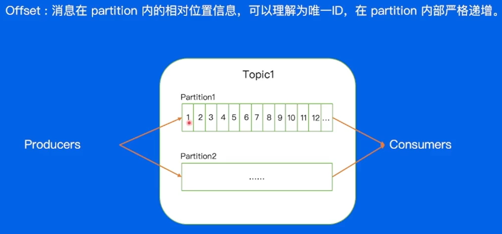

Replica：

副本，完成容灾

Follower努力与Leader保持一致

差距过大会被从ISR中删除

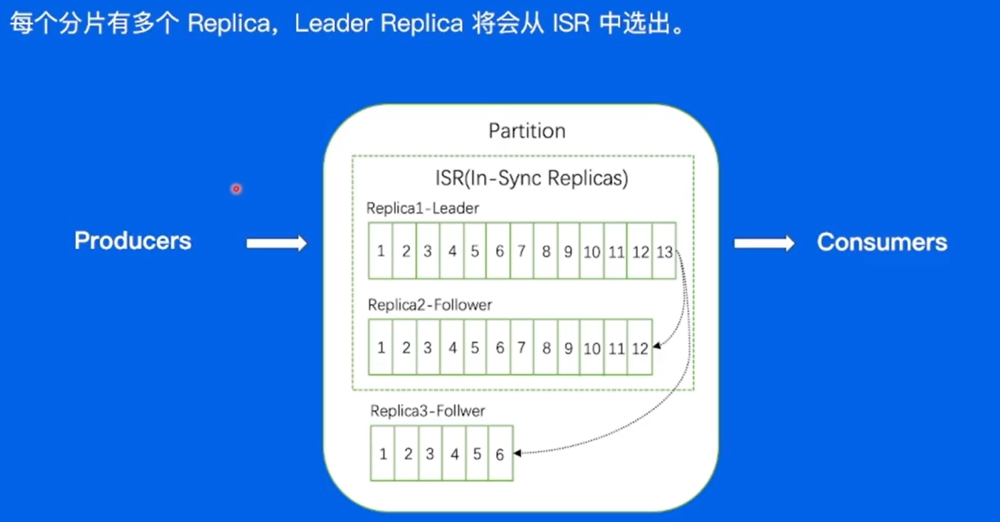

2.4 数据复制

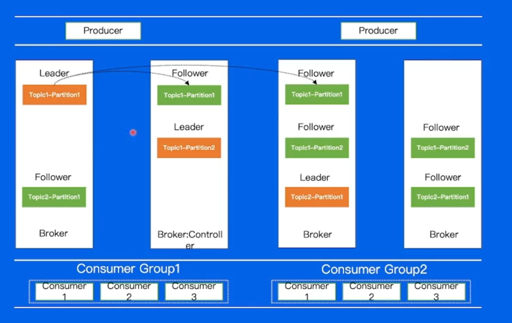

2.5 Kafka架构

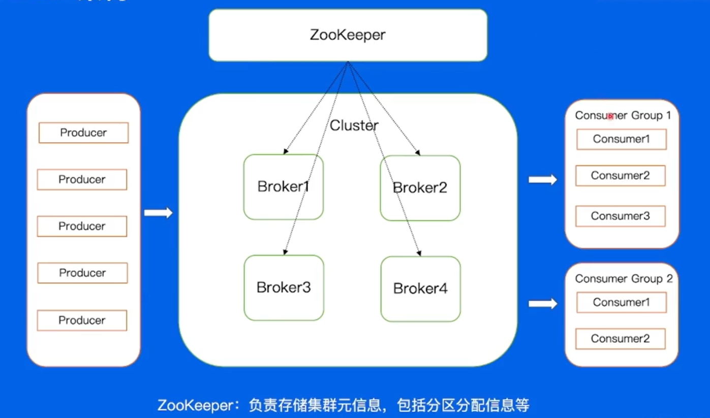

2.6 一条消息的自述

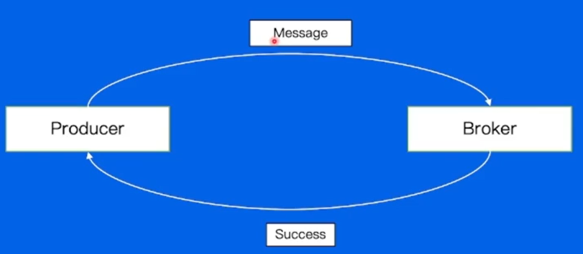

如果发送一条消息，等到其成功之后再发一条会有什么问题？ 消息处理速度太慢

2.7 Producer：可以选择进行批量处理

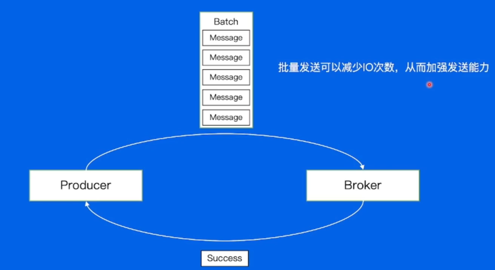

新问题 - 消息量很大的时候，网络带宽不够用

Producer Kafka支持数据压缩，通过压缩可以较少消息大小

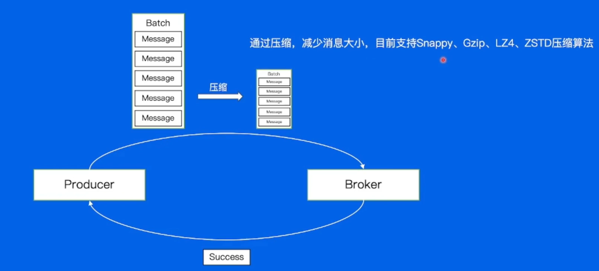

2.8 Broker 数据存储

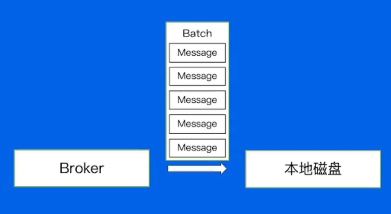

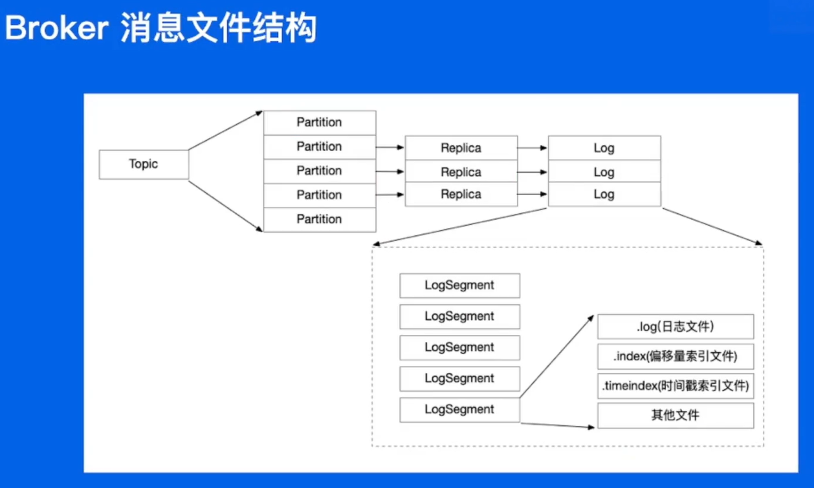

数据路径：/Topic/Partition/Segment/(log | index | timeindex | ......)

Broker 顺序写

Broker  如何找到消息

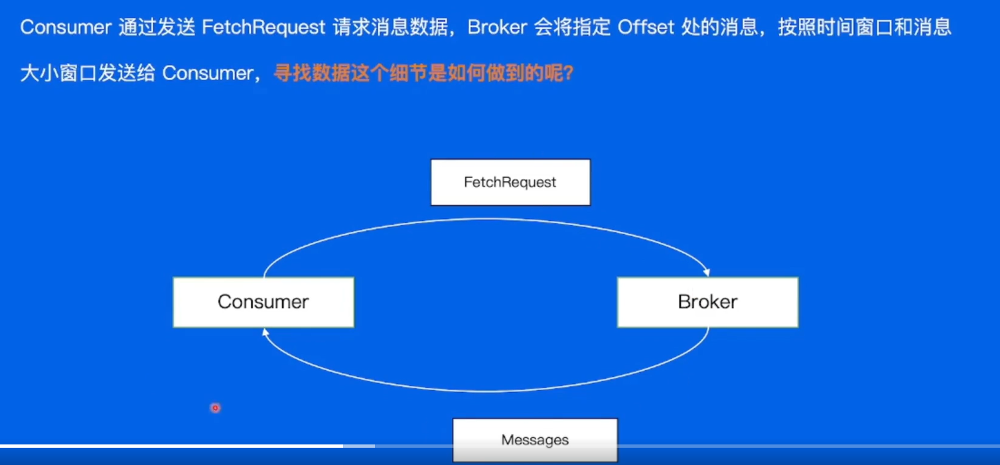

 二分法寻找磁盘中的数据

Broker 传统数据拷贝

Broker 零拷贝

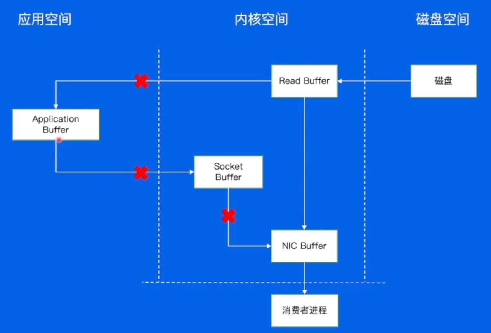