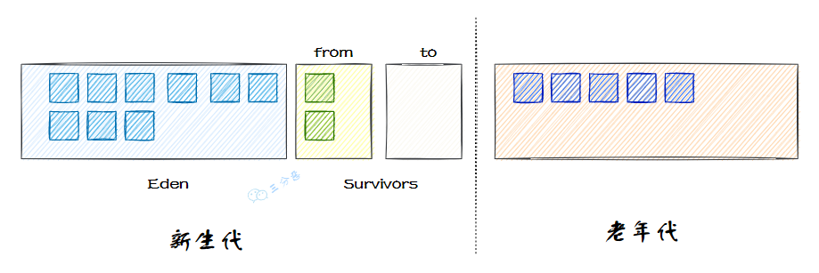
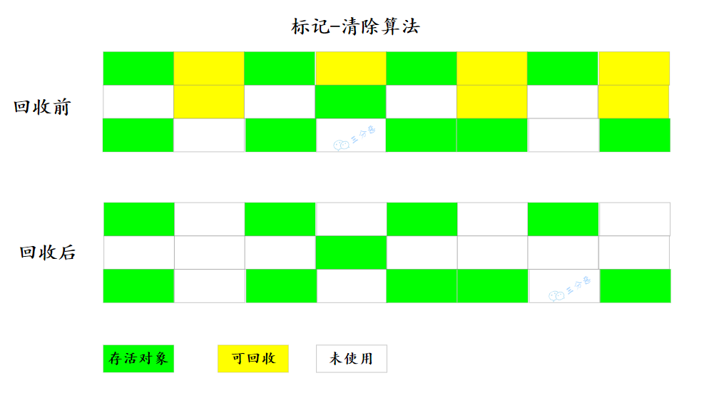

# 垃圾收集算法

## 1. 分代收集理论

按照垃圾收集，将 Java 堆划分为 新生代 （Young Generation）**和**老年代（Old Generation） 两个区域，新生代存放存活时间短的对象，而每次回收后存活的少量对象，将会逐步晋升到老年代中存放。

而新生代又可以分为三个区域，Eden、from、to，比例是 8：1：1，而新生代的内存分区同样是从垃圾收集的角度来分配的。

## 2. 标记-清除算法

见名知义，`标记-清除`（Mark-Sweep）算法分为两个阶段：

- **标记** : 标记出所有需要回收的对象
- **清除**：回收所有被标记的对象

标记-清除算法比较基础，但是主要存在两个缺点：

- 执行效率不稳定，如果 Java 堆中包含大量对象，而且其中大部分是需要被回收的，这时必须进行大量标记和清除的动作，导致标记和清除两个过程的执行效率都随对象数量增长而降低。
- 内存空间的碎片化问题，标记、清除之后会产生大量不连续的内存碎片，空间碎片太多可能会导致当以后在程序运行过程中需要分配较大对象时无法找到足够的连续内存而不得不提前触发另一次垃圾收集动作。

## 3. 标记-复制算法

标记-复制算法解决了标记-清除算法面对大量可回收对象时执行效率低的问题。

过程也比较简单：将可用内存按容量划分为大小相等的两块，每次只使用其中的一块。当这一块的内存用完了，就将还存活着的对象复制到另外一块上面，然后再把已使用过的内存空间一次清理掉。

这种算法存在一个明显的缺点：一部分空间没有使用，存在空间的浪费。

新生代垃圾收集主要采用这种算法，因为新生代的存活对象比较少，每次复制的只是少量的存活对象。当然，实际新生代的收集不是按照这个比例。

## 4. 标记-整理算法

为了降低内存的消耗，引入一种针对性的算法：`标记-整理`（Mark-Compact）算法。

其中的标记过程仍然与“标记-清除”算法一样，但后续步骤不是直接对可回收对象进行清理，而是让所有存活的对象都向内存空间一端移动，然后直接清理掉边界以外的内存。

标记-整理算法主要用于老年代，移动存活对象是个极为负重的操作，而且这种操作需要 Stop The World 才能进行，只是从整体的吞吐量来考量，老年代使用标记-整理算法更加合适。

**为什么老年代使用标记-整理法：**

使用标记-清除那种方式完全不考虑移动和整理对象的话，会使 空间碎片化问题愈加的严重，只能依赖更加复杂的内存分配器和内存访问器去解决，内存的访问是用户程序中最频繁的操作，会严重的影响程序的吞吐量。所以说老年代使用标记-整理法相对其他算法来说是优解。还有一种比这种更好的方式就是多数时间使用标记-清除算法，直到空间碎片化情况无法忍受时，使用标记-整理算法进行处理。

