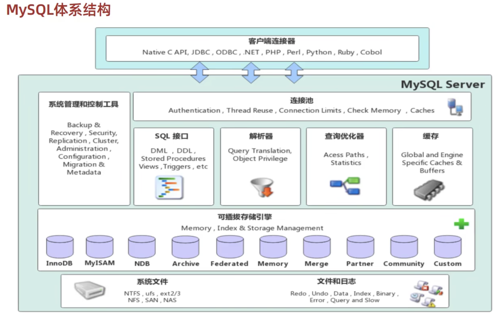
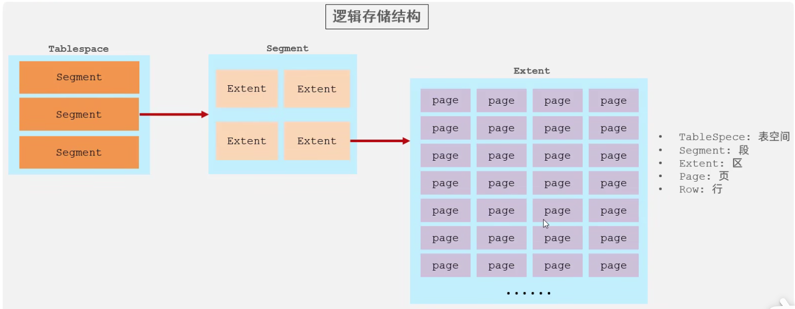
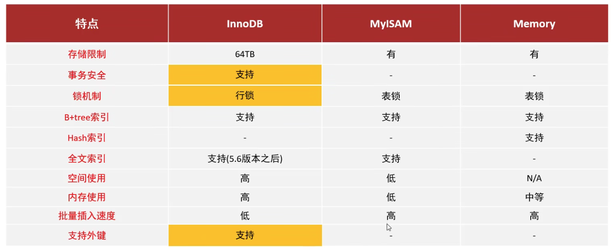

# MySQL-进阶篇

## 1. 存储引擎

### MySQL体系结构



- 连接层

  - 最上层是一些客户端和连接服务，主要完成一些类似于连接处理、授权认证、以及相关的安全方案。服务器也会为安全接入的每个客户端验证它所具有的操作权限。

* 服务层
  - 第二层架构主要完成大多数的核心服务功能，如SQL接口，并完成缓存的查询，SQL的分析和优化，部分内置函数的执行。所有跨存储引擎的功能也在这一层实现，如存储过程、函数等。

* 引擎层
  - 存储引擎真正的负责了MySQL中数据的存储和提起，服务器通过API和存储引擎进行通信。不同的存储引擎具有不同的功能，这样我们可以根据自己的需要，来选取合适的存储引擎。
* 存储层
  - 主要是将数据(如: redolog、undolog、数据、索引、二进制日志、错误日志、查询日志、慢查询日志等)存储在文件系统之上，并完成与存储引擎的交互。

### 存储引擎简介

> 和其他数据库相比，MySQL有点与众不同，它的架构可以在多种不同场景中应用并发挥良好作用。主要体现在存储引擎上，插件式的存储引擎架构，将查询处理和其他的系统任务以及数据的存储提取分离。这种架构可以根据业务的需求和实际需要选择合适的存储引擎。

存储引擎就是存储数据、建立索引、更新/查询数据等技术的实现方式。存储引擎是基于表的，而不是基于库的，所以存储引擎也可被称为表类型。我们可以在创建表的时候，来指定选择的存储引擎，如果没有指定将自动选择默认的存储引擎。

**建表时指定存储引擎：**

```sql
CREATE TABLE 表名(
字段1 字段1类型 [ COMMENT 字段1注释 ] ,
......
字段n 字段n类型 [COMMENT 字段n注释 ]
) ENGINE = INNODB [ COMMENT 表注释 ] ;
```

### InnoDB

介绍：InnoDB是一种兼顾高可靠性和高性能的通用存储引擎，在MySQL 5.5 之后，InnoDB是默认MySQL的存储引擎。

特点：

* DML操作遵循ACID模型，支持**事务**
* **行级锁**，提高并发访问性能
* 支持**外建** `FOREIGN KEY` 约束，保证数据的完整性和正确性。

文件：xxx.idb： xxx代表的是表名，InnoDB引擎的每张表都会对应这样一个**表空间文件**，存储该表的表结构（frm-早期,sdi-新版8.0)、数据和索引。



- **表空间** : InnoDB存储引擎逻辑结构的最高层，ibd文件其实就是表空间文件，在表空间中可以包含多个Segment段。
- **段** : 表空间是由各个段组成的， 常见的段有数据段、索引段、回滚段等。InnoDB中对于段的管理，都是引擎自身完成，不需要人为对其控制，一个段中包含多个区。
- **区** : 区是表空间的单元结构，每个区的大小为1M。 默认情况下， InnoDB存储引擎页大小为16K， 即一个区中一共有64个连续的页。
- **页** : 页是组成区的最小单元，页也是InnoDB存储引擎磁盘管理的最小单元，每个页的大小默认为 16KB。为了保证页的连续性，InnoDB 存储引擎每次从磁盘申请 4-5 个区。
- **行** : InnoDB 存储引擎是面向行的，也就是说数据是按行进行存放的，在每一行中除了定义表时所指定的字段以外，还包含两个隐藏字段(后面会详细介绍)。

### MyISAM

介绍：MySQL早期默认的存储引擎

特点：

* 不支持事务，不支持外键
* 支持表锁，不支持行锁
* 访问速度快

文件：

- xxx.sdi：存储表结构信息
- xxx.MYD：存储数据
- xxx.MYI：存储索引

### Memory

介绍：

- Memory引擎的表数据是存放在内存中的，由于受到硬件问题或断电问题的影响，只能将这些表作为临时表或缓存使用。

特点：

- 内存存放
- hash索引（默认）

文件：

 xxx.sdi : 存储表结构信息

### 三者之间的区别



### 存储引擎选择

在选择存储引擎时，应该根据应用系统的特点选择合适的存储引擎。对于复杂的应用系统，还可以根据实际情况选择多种存储引擎进行组合。

- **InnoDB:** 是Mysql的默认存储引擎，支持事务、外键、行级锁。如果应用对**事务的完整性**有比较高的要求，在并发条件下要求数据的**一致性**，数据操作除了插入和查询之外，还包含很多的更新、删除操作，那么InnoDB存储引擎是比较合适的选择。
- MyISAM （被MongoDB取代）： 如果应用是**以读操作和插入操作为主**，只有很少的更新和删除操作，并且对事务的完整性、并发性要求不是很高，那么选择这个存储引擎是非常合适的。（日志，电商足迹、评论等业务场景下）
- MEMORY（被Redis取代）：将所有数据保存在内存中，访问速度快，通常用于临时表及缓存。MEMORY的缺陷就是对表的大小有限制，太大的表无法缓存在内存中，而且无法保障数据的安全性。

## 2. 索引

