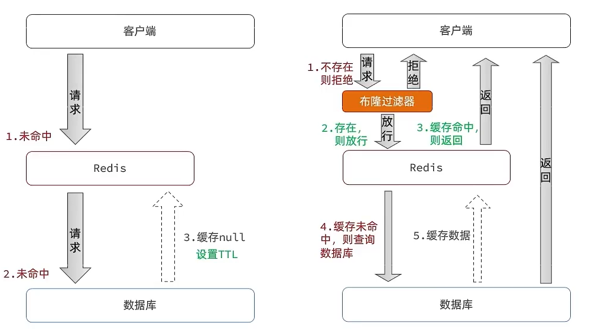

# 缓存穿透问题

缓存穿透 ：缓存穿透是指客户端请求的数据在缓存中和数据库中都不存在，这样缓存永远不会生效，这些请求都会打到数据库。

常见的解决方案有两种：

* 缓存空对象
  * 优点：实现简单，维护方便
  * 缺点：
    * 额外的内存消耗
    * 可能造成短期的不一致
* 布隆过滤
  * 优点：内存占用较少，没有多余key
  * 缺点：
    * 实现复杂
    * 存在误判可能


**缓存空对象思路分析：**当我们客户端访问不存在的数据时，先请求redis，但是此时redis中没有数据，此时会访问到数据库，但是数据库中也没有数据，这个数据穿透了缓存，直击数据库，我们都知道数据库能够承载的并发不如redis这么高，如果大量的请求同时过来访问这种不存在的数据，这些请求就都会访问到数据库，简单的解决方案就是哪怕这个数据在数据库中也不存在，我们也把这个数据存入到redis中去，这样，下次用户过来访问这个不存在的数据，那么在redis中也能找到这个数据就不会进入到缓存了


**布隆过滤：**布隆过滤器其实采用的是哈希思想来解决这个问题，通过一个庞大的二进制数组，走哈希思想去判断当前这个要查询的这个数据是否存在，如果布隆过滤器判断存在，则放行，这个请求会去访问redis，哪怕此时redis中的数据过期了，但是数据库中一定存在这个数据，在数据库中查询出来这个数据后，再将其放入到redis中，

假设布隆过滤器判断这个数据不存在，则直接返回

这种方式优点在于节约内存空间，存在误判，误判原因在于：布隆过滤器走的是哈希思想，只要哈希思想，就可能存在哈希冲突



* ### 实现方案demo
  使用Guava在内存中维护一个布隆过滤器。具体步骤如下：
  1. 添加Guava和Redis依赖：
  ```java
  <dependency>
      <groupId>com.google.guava</groupId>
      <artifactId>guava</artifactId>
      <version>29.0-jre</version>
  </dependency>
  
  <dependency>
      <groupId>org.springframework.boot</groupId>
      <artifactId>spring-boot-starter-data-redis</artifactId>
  </dependency>
  ```
  2. 创建一个BloomFilterUtil类，用于在缓存中维护Bloom Filter。

  

  ```java
  public class BloomFilterUtil {
      // 布隆过滤器的预计容量
      private static final int expectedInsertions = 1000000;
      // 布隆过滤器误判率
      private static final double fpp = 0.001;
      private static BloomFilter<String> bloomFilter = BloomFilter.create(Funnels.stringFunnel(Charset.defaultCharset()), expectedInsertions, fpp);
      /**
       * 向Bloom Filter中添加元素
       */
      public static void add(String key){
          bloomFilter.put(key);
      }
      /**
       * 判断元素是否存在于Bloom Filter中
       */
      public static boolean mightContain(String key){
          return bloomFilter.mightContain(key);
      }
  }
  
  ```
  3. 在Controller中查询数据时，先根据请求参数进行Bloom Filter的过滤

  ```java
  @Autowired
  private RedisTemplate<String, Object> redisTemplate;
  
  @GetMapping("/user/{id}")
  public User getUserById(@PathVariable Long id){
      // 先从布隆过滤器中判断此id是否存在
      if(!BloomFilterUtil.mightContain(id.toString())){
          return null;
      }
      // 查询缓存数据
      String userKey = "user_"+id.toString();
      User user = (User) redisTemplate.opsForValue().get(userKey);
      if(user == null){
          // 查询数据库
          user = userRepository.findById(id).orElse(null);
          if(user != null){
              // 将查询到的数据加入缓存
              redisTemplate.opsForValue().set(userKey, user, 300, TimeUnit.SECONDS);
          }else{
              // 查询结果为空，将请求记录下来，并在布隆过滤器中添加
              BloomFilterUtil.add(id.toString());
          }
      }
      return user;
  }
  ```

  

  >其他的解决优化方案：

  * 增强id的复杂度，避免被猜测id规律
  * 做好数据的基础格式校验
  * 加强用户权限校验
  * 做好热点参数的限流