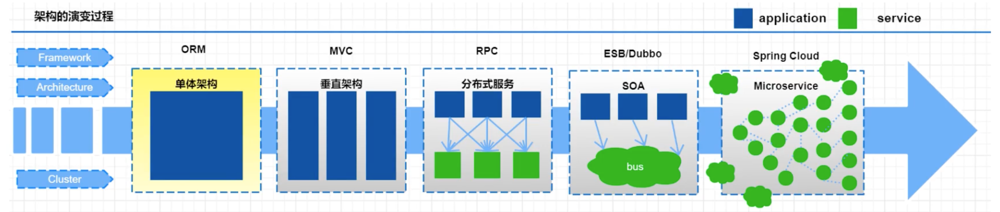

# 微服务介绍

## 1.单体应用架构

互联网早期，一般的网站应用流量较小，只需一个应用，将所有功能代码都部署在一起就可以，这样可以减少开发、部署和维护的成本。

优点：

* 项目架构简单，开发成本低
* 维护方便，只有一个服务器需要维护

缺点：

* 对于大型项目来说不易维护
* 项目模块之间紧密耦合，单点容错率低
* 无法针对不同模块进行针对性优化和水平扩展

## 2. 垂直架构

所谓的垂直应用架构，就是将原来的一个应用拆成互不相干的几个应用，以提升效率。一旦某个模块用户访问量增大，增加对应的节点即可。

优点：

* 系统拆分实现了流量分担，解决了并发问题，而且可以针对不同模块进行优化和水扩展
* 提高容错率

缺点：

* 系统之间相互独立，无法进行相互调用、且会有重读的开发任务

## 3. 分布式架构

将把工程拆分成表现层和服务层两个部分，服务层中包含业务逻辑。表现层只需要处理和页面的交互，业务逻辑都是调用服务层的服务来实现。

优点：

* 抽取公共的功能为服务层，提高代码的复用性

缺点：

* 系统间耦合度变高，调用关系错综复杂，难以维护

## 4. SOA架构

在分布式架构下，当服务越来越多，容量的评估，小服务资源的浪费等问题逐渐显现，此时需增加一个调度中心对集群进行实时管理。

优点：

* 使用治理中心(ESB\dubbo)解决了服务间调用关系的自动调节

缺点：

* 服务间会有依赖关系，一旦某个环节出错会影响较大( 服务雪崩 )
* 服务关系复杂，运维、测试部署困难

## 5.微服务架构

微服务架构在某种程度上是面向服务的架构SOA继续发展的下一步，它更加强调服务的"彻底拆分"。

优点：

* 服务原子化拆分，独立打包、部署和升级，保证每个微服务清晰的任务划分，利于扩展
* 微服务之间采用Restful等轻量级http协议相互调用

缺点：

* 分布式系统开发的技术成本高(容错、分布式事务等)
* 复杂性更高。各个微服务进行分布式独立部署，当进行模块调用的时候，分布式将会变得更加麻烦

https://blog.cuicc.com/blog/2015/07/22/microservices