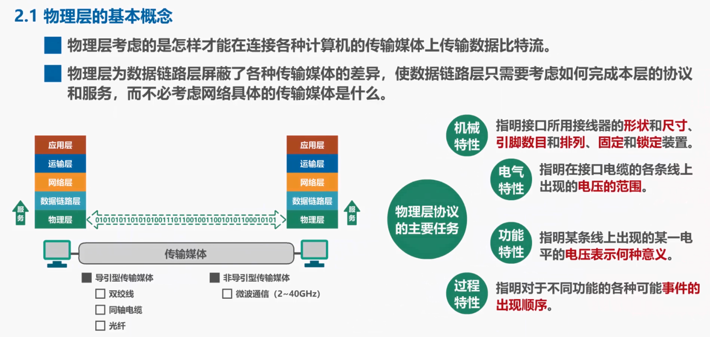
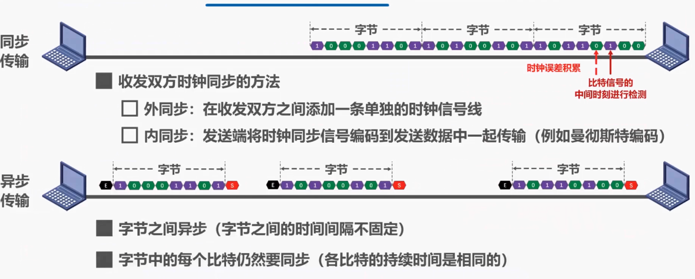
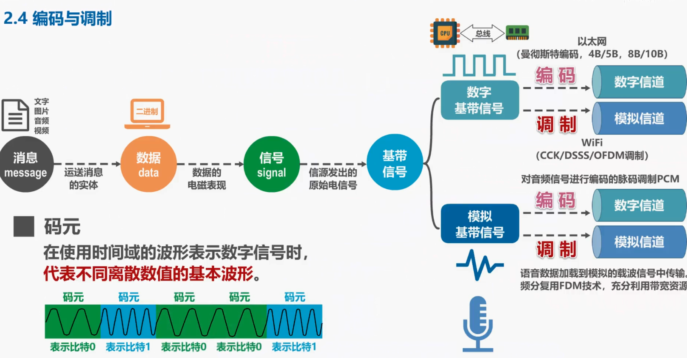

# 物理层

## 1. 物理层的基本概念

## 2.物理层下面的传输媒体

传输媒体可分为两类，一类是导引型传输媒体，另一类是非导引型传输媒体。

## 3.传输方式

### 3.1 串行传输和并行传输

* **串行传输**：串行传输是指数据是一个比特依次发送的，因此在发送端和接收端之间只需要一条数据传输线路即可。
* **并行传输**：指一次发送n个比特，而不是一个比特。为此在发送端和接收端之间需要有n条传输线路。

数据在传输线路上的传输采用的是串行传输，计算机内部的数据传输常采用并行传输方式，例如CPU与内存之间通过总线进行数据传输，常见的数据总线宽度有8位、16位、32位和64位。

### 3.2 同步传输和异步传输

* 同步传输：数据块以稳定的比特流的形式传输，字节之间没有间隔，接收端在每个比特信号的中间时刻进行检测，以判别接收到的是比特0还是比特1。由于不同设备的时钟频率存在一定差异，不可能做到完全相同，在传输大量数据的过程中，所产生的判别时刻的累积误差，会导致接收端对比特信号的判别错位。因此需要采取方法是收发双方的时钟保持同步。

### 3.3 单工，半双工以及全双工通信

- 单工通信又称为单向通信，通信双方只有一个数据传输方向，比如**无线电广播**采用的就是这种通信方式
- 半双工又称为双向交替通信，通信双方可以相互传输数据，但不能同时进行。例如**对讲机**采用的就是这种通信方式
- 全双工通信又称为双向同时通信，双方可以同时发送和接收信息，例如**电话**采用的就是这种通信方式，

## 4.编码和调制

- 在不改变信号性质的前提下，**仅对数字基带信号的波形进行变换，‍‍称为编码**。编码后产生的信号仍为数字信号，可以在数字信道中传输，例如以太网使用曼彻斯特编码，4B/5B、8B/10B等编码
- 把数字基带信号的频率范围搬移到较高的频段，**并转换为模拟信号，称为调制**。调制后产生的信号是模拟信号，可以在模拟信道中传输。例如WiFi使用补码键控，直接序列扩频，正交评分复用等调制方法。

## 5. 信道的极限容量

我们都知道信号在传输过程中会受到各种因素的影响，如图所示这是一个数字信号，‍‍当它通过实际的信道后，波形会产生失真，当失真不严重时，在输出端‍‍还可根据以失真的波形还原出发送的码元，但当失真严重时，在输出端‍‍就很难判断这个信号‍‍在什么时候是1和在什么时候是0。信号波形失去了码元之间的清晰界限，‍‍这种现象叫做码间串扰。‍‍

* 奈氏准则
* 香农公式

