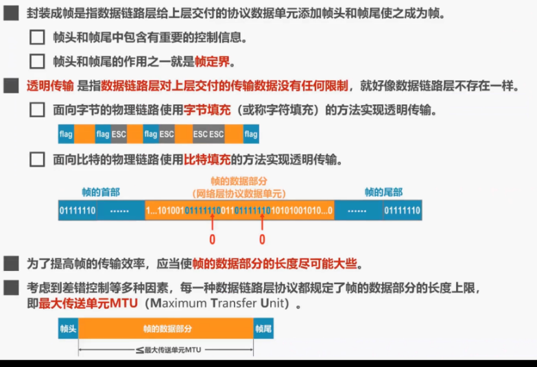
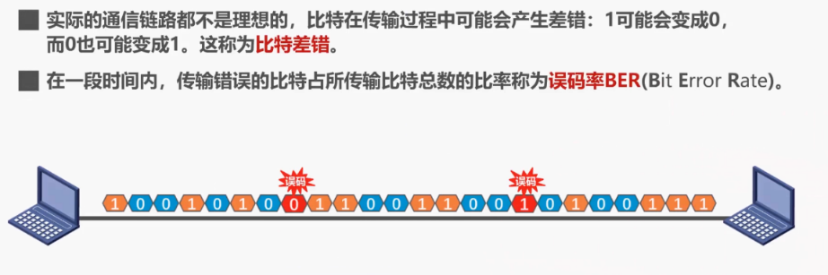
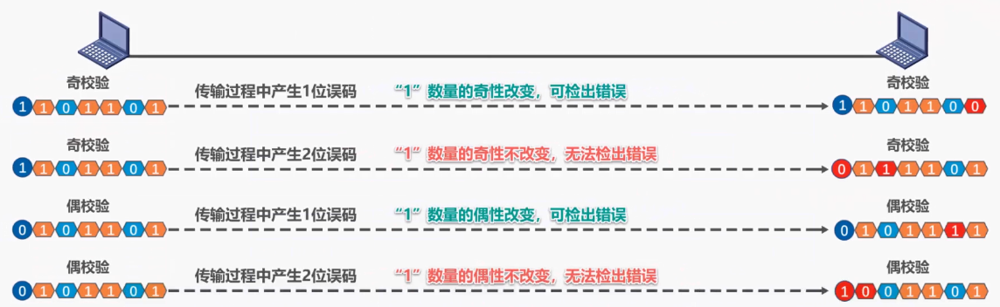
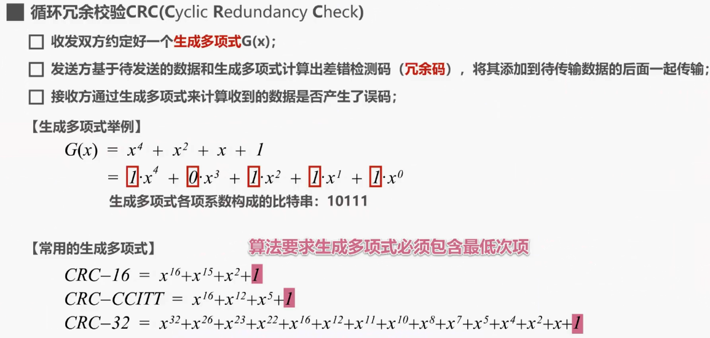

# 数据链路层

## 1. 数据链路层概述

所谓**链路**，就是从一个节点到相邻节点的一段物理线路，中间没有任何其他的交换节点。要在链路上传输数据，仅有链路还不够，还需要一些通信协议来控制这些数据的传输。若把实现这些协议的硬件和软件加到电路上，就构成了数据链路。

在数据链路层上传输的数据包又称为**帧**，也就是说数据链路层以帧为单位传输和处理数据。

接下来我们介绍数据链路层的三个重要问题，他们是**封装成帧，差错检测，可靠传输**。

### 1.1 封装成帧

两台主机通过一段链路互联，两台主机都会对所发送或接收的数据包进行5个层次的封装或解封:

- 发送方将待发送的数据通过应用层封装成为应用层协议数据单元，然后交付给运输层，
- 运输层为其添加运输层协议首部，使之成为运输层协议数据单元，然后交付给网络层，
- 网络层为其添加网络层协议首部，使之成为网络层协议数据单元，然后交付给数据链路层，
- 数据链路层给网络层协议数据单元，添加一个数据链路层协议首部简称为**帧头**，还要给其添加一个帧尾。
- 我们将数据链路层给网络层交付的协议数据单元，添加帧头和帧尾的操作成为**封装成帧**。添加帧头和帧尾的目的都是为了在链路上以帧为单元来传送数据，也就是为了实现数据链路层本身的功能。

### 1.2 差错检测

发送方将封装好的帧通过物理层发送到传输媒体，帧在传输过程中遭遇干扰后可能会出现误码，也就是比特0可能变成了比特1，反之亦然。接收方主机收到帧后，通过**检错码和检错算法**，就可以判断出真在传输过程中是否出现了误码。

### 1.3 可靠传输

接收方主机收到有误码的帧后，是不会接受该帧的，将其丢弃。

* 如果数据链路层向其上层提供的是**不可靠服务**，那么丢弃就丢弃了，不会再有更多措施。

* 如果数据链路层向其上层提供的是**可靠服务**，那么就还需要其他措施来确保接收方主机还可以重新收到被丢弃的帧的正确副本。

换句话说，尽管误码是不能完全避免的，但若能实现发送方发送什么，接收方最终都能收到什么？就称为可靠传输。

## 2. 封装成帧

**封装成帧**就是指数据链路层给上层交付下来的协议数据单元，添加帧头和帧尾，‍‍使之成为帧。

## 3. 差错检测

### 3.1 奇偶校验

在待发送的数据后面添加一位奇偶校验位，‍‍使整个数据包括所添加的校验位在内中的1的个数为基数这称为奇校验，或为偶数这称为偶校验。‍‍

### 3.2 循环冗余校验CRC

