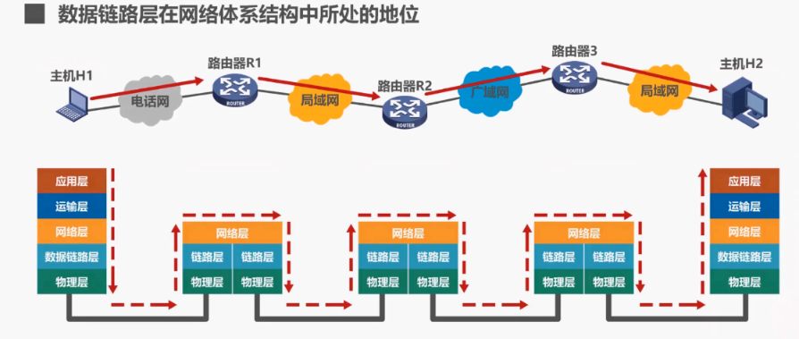
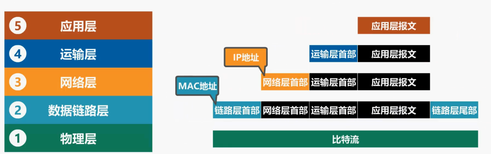

# 数据链路层

## 1. 数据链路层概述

所谓**链路**，就是从一个节点到相邻节点的一段物理线路，中间没有任何其他的交换节点。要在链路上传输数据，仅有链路还不够，还需要一些通信协议来控制这些数据的传输。若把实现这些协议的硬件和软件加到电路上，就构成了数据链路。

在数据链路层上传输的数据包又称为**帧**，也就是说数据链路层以帧为单位传输和处理数据。

接下来我们介绍数据链路层的三个重要问题，他们是**封装成帧，差错检测，可靠传输**。

1.1 封装成帧

两台主机通过一段链路互联，两台主机都会对所发送或接收的数据包进行5个层次的封装或解封:

- 发送方将待发送的数据通过应用层封装成为应用层协议数据单元，然后交付给运输层，
- 运输层为其添加运输层协议首部，使之成为运输层协议数据单元，然后交付给网络层，
- 网络层为其添加网络层协议首部，使之成为网络层协议数据单元，然后交付给数据链路层，
- 数据链路层给网络层协议数据单元，添加一个数据链路层协议首部简称为**帧头**，还要给其添加一个帧尾。
- 我们将数据链路层给网络层交付的协议数据单元，添加帧头和帧尾的操作成为**封装成帧**。添加帧头和帧尾的目的都是为了在链路上以帧为单元来传送数据，也就是为了实现数据链路层本身的功能。

### 1.2 差错检测

发送方将封装好的帧通过物理层发送到传输媒体，帧在传输过程中遭遇干扰后可能会出现误码，也就是比特0可能变成了比特1，反之亦然。接收方主机收到帧后，通过**检错码和检错算法**，就可以判断出真在传输过程中是否出现了误码。

### 1.3 可靠传输

接收方主机收到有误码的帧后，是不会接受该帧的，将其丢弃。

* 如果数据链路层向其上层提供的是**不可靠服务**，那么丢弃就丢弃了，不会再有更多措施。

* 如果数据链路层向其上层提供的是**可靠服务**，那么就还需要其他措施来确保接收方主机还可以重新收到被丢弃的帧的正确副本。

换句话说，尽管误码是不能完全避免的，但若能实现发送方发送什么，接收方最终都能收到什么？就称为可靠传输。

## 2. 封装成帧

**封装成帧**就是指数据链路层给上层交付下来的协议数据单元，添加帧头和帧尾，‍‍使之成为帧。

## 3. 差错检测

### 3.1 奇偶校验

在待发送的数据后面添加一位奇偶校验位，‍‍使整个数据包括所添加的校验位在内中的1的个数为基数这称为奇校验，或为偶数这称为偶校验。‍‍

### 3.2 循环冗余校验CRC

## 4.可靠传输

**传输差错**：

+ 比特差错（出现在数据链路层及其下层）
+ 分组重复（出现在数据链路层的上层）
+ 分组丢失（出现在数据链路层的上层）
+ 分组失序（出现在数据链路层的上层）

可靠传输服务并不局限于数据链路层，其余各层均可选择实现可靠传输。

### 4.1 停止-等待协议

* 确认与否认：假设这个数据分组在传输过程中出现了误码，‍‍接收方收到后对其进行差错检测，‍‍发现了误码，则丢弃该数据分组，并给发送方发送否认分组，简称为nak‍‍

* 超时重传：设置一个超时重传时间（RTO），重传时间略大于从发送方到接收方的平均往返时间（RTT）
* 确认丢失：为了避免分组重复这种传输错误，‍‍必须给每个数据分组带上序号。‍‍
* 确认迟到

### 4.2 回退N帧协议

回退N帧协议，该协议在流水线传输的基础上，利用发送窗口，来限制发送方‍‍可连续发送分组的个数。

我们对回退n帧协议的工作原理进行一下小结。‍‍发送窗口尺寸wt的取值范围是大于1，小于等于2的n次-1，其中‍‍ n是构成分组序号的比特数量，若wt等于1则变回了停止等待协议，‍‍若WT>2的n次-1，则会造成接收方无法分辨新旧数据分组的问题。‍‍

接收方的接收窗口尺寸WR‍‍只能等于1，因此接收方只能按序接收数据分组，发送方可在未收到接收方确认分组的情况下，‍‍将序号落在发送窗口内的多个数据分组全部发送出去，接收方只接受序号落在接收窗口内，‍‍且无误码的数据分组，并且将接收窗口向前滑动一个位置。与此同时，‍‍给发送方发回相应的确认分组。‍‍

‍

为了减少开销，接收方不一定每收到一个按需到达‍‍且无误码的数据分组，就给发送方发回一个确认分组，而是可以在连续收到好几个按需到达，‍‍且无误码的数据分组后，‍‍才针对最后一个数据分组发送确认分组，这要成为累计确认，或者可以在自己有数据分组要发送时，‍‍才对之前按序接收，无码的数据分组进行捎带确认。

‍

接收方收到未按需到达的数据分组，‍‍除丢弃外，还要对最近按序接收的数据分组进行确认。‍‍

发送方只有收到对已发送数据分组的确认时，发送窗口才能向前相应滑动。‍‍发送方收到多个重复确认时，可在重传计时器超时前尽早开始重传，由具体实现决定，‍‍

**发送方发送窗口内，某个已发送的数据分组产生超时重发时，‍‍其后续在发送窗口内且已发送的数据分组也必须全部重传，‍‍这就是回退n帧协议名称的由来。**

### 4.3 选择重传协议

我们对选择重传协议的工作原理进行一下小结，‍‍这是我们刚刚举例说明过的，‍‍发送窗口和接收窗口的尺寸问题，就不再赘述了。‍‍发送方可在未收到接收方确认分组的情况下，‍‍将序号落在发送窗口内的多个数据分组全部发送出去，接收方可接收未按需到达，‍‍但没有误码，并且序号落在接收窗口内的数据分组。

为了使发送方仅重传出现差错的分组，‍‍接收方不能再采用累计确认，而需要对每个正确接收到的数据分组进行逐一确认。‍‍

接收方只有在按序接收数据分组后，接收窗口才能向前相应滑动。‍‍

发送方只有按序收到，‍‍对已发送数据分组的确认分组时，发送窗口才能向前相应滑动。

若收到未按需到达的确认分组，‍‍应对其进行记录，以防止其相应数据分组的超时重发，但发送窗口不能向前滑动。‍‍

## 5.点对点协议PPP

PPP协议为在点对点链路传输各种协议数据报提供了一个标准方法，‍‍主要由以下三部分构成。‍‍

- 第一，对各种协议数据报的封装方法，‍‍也就是我们之前课程中介绍的封装成帧。
- 第二，链路控制协议lcp，用于建立配置‍‍以及测试数据链路的连接。
- 第三，一套网络控制协议ncps，其中的每一个协议‍‍支持不同的网络层协议

从网络体系结构的角度看，PPP是数据链路层的协议，‍‍他将上层交付下来的协议数据单元‍‍封装成PPP帧.

为了支持不同的网络层协议，PPP协议包含了一套网络控制协议ncp‍‍s，其中的每一个协议支持不同的网络层协议，例如tcpip中的IP‍‍ novell neteware，网络操作系统中的IPX，苹果公司的apple talk等。

链路控制协议LCP，用于建立配置以及测试数据链路的连接，PPP协议能够在多种类型的点对点链路上运行，‍‍例如面向字节的异步联络，‍‍面向比特的同步链路。‍‍

**PPP的工作状态**：（以用户主机拨号接入因特网服务提供者ISP的拨号服务器的过程为例）

## 6. MAC地址

- **MAC地址**是以太网的MAC层所使用的地址
- **IP地址**是TCP/IP体系结构网系层所使用的地址。
- **ARP协议**属于tcpip体系结构的网际层，其作用是已知设备所分配到的IP地址，使用ARP协议，就可以通过该IP地址获取到设备的MAC地址。

当多个主机连接在同一个广播信道上，要想实现两个主机之间的通信，则每个主机都必须有一个唯一的标识，即一个数据链路层地址；

在每个主机发送的帧中必须携带标识发送主机和接收主机的地址。由于这类地址是用于媒体接入控制`MAC(Media Access Control)`,因此这类地址被称为MAC地址。

* MAC地址一般被固化在网卡（网络适配器）的电可擦可编程只读存储器EEPROM中，因此MAC地址也被称为硬件地址；
* MAC地址有时也被称为物理地址。请注意：这并不意味着MAC地址属于网络体系结构中的物理层！

一般情况下，用户主机会包含两个网络适配器：**有线局域网适配器（有线网卡）**和**无线局域网适配器（无线网卡）**。每个网络适配器都有一个全球唯一的MC地址。而交换机和路由器往往拥有更多的网络接口，所以会拥有更多的MAC地址。综上所述，严格来说，MAC地址是对网络上各接口的唯一标识，而不是对网络上各设备的唯一标识。

## 7. IP地址

IP地址属于网络层的范畴，而非数据链路层的范畴，之所以在数据链路层这一章的讲解中引入IP地址，是因为在我们日常的大多数网络应用中，属于数据链路层的MAC地址和属于网络层的IP地址都在使用，他们之间存在一定的关系。Ip地址的相关内容比较多，例如分类的IP地址，划分子网的IP地址，构造超网的IP地址等。

IP地址是英特网上的主机和路由器所使用的地址，用于标识两部分信息，

- 一部分是网络编号，用来标识因特网上数以百万计的网络
- 另一部分是主机编号，用来标识同一网络上不同主机或路由器各接口

