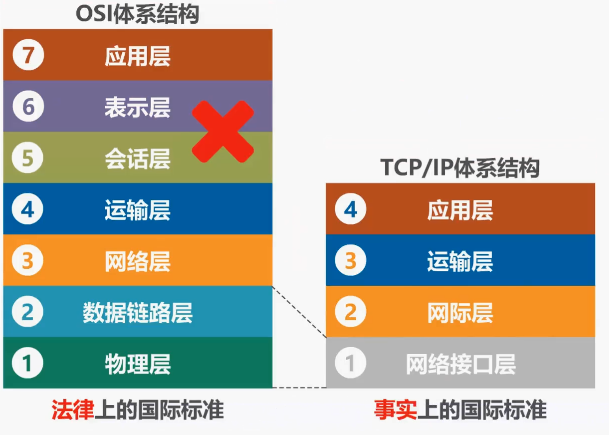
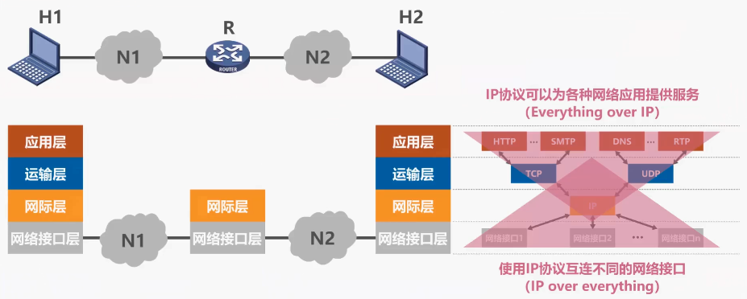
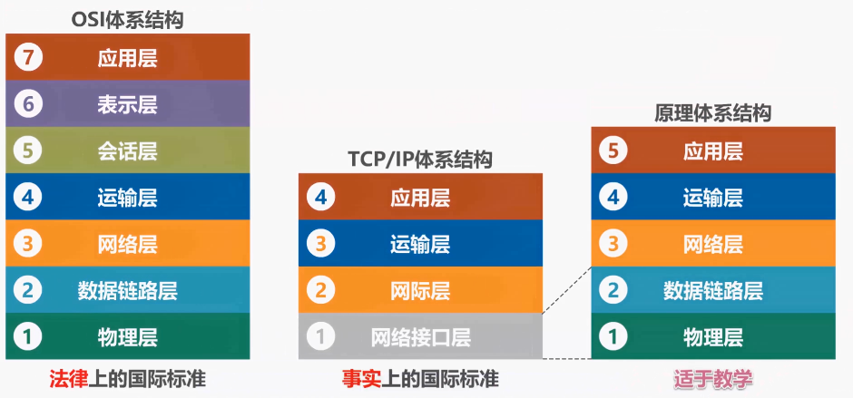
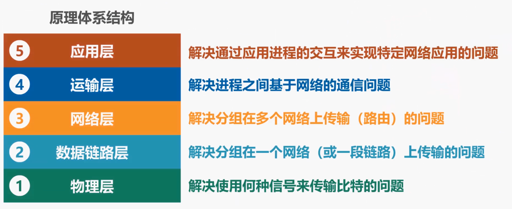

# 计算机网络体系结构

> 湖科大教程

## 一、常见的计算机体系结构

### 1.1 OSI标准以及TCP/IP体系结构

OSI标准失败的原因：

1. OSI的专家们缺乏实际经验，他们在完成OSI标准时没有商业驱动力
2. OSI的协议实现起来过分复杂，而且运行效率很低
3. OSI标准的制定周期太长，因而使得按OSI标准生产的设备无法及时进入市场
4. OSI的层次划分也不太合理，有些功能在多个层次中重复出现

### 1.2 TCP/IP体系结构

在tcpip体系结构中包含有大量的协议，IP协议和TCP协议是其中非常重要的两个协议，因此用TCP和IP这两个协议来表示整个协议大家族常称为tcpip协议族。

### 1.3 原理体系结构

由于tcpip体系结构，为了将不同的网络接口进行互联，因此它的网络接口层并没有规定什么具体的内容。然而这对于我们学习计算机网络的完整体系而言，就会缺少一部分内容，因此在学习计算机网络原理时，往往采取折中的办法，也就是综合OSI和tcpip的优点，采用一种5层协议的原理体系结构。

### 1.4 网络体系分层的必要性

分层可以将庞大而复杂的问题转化成若干较小的局部问题。

* **物理层**：采用怎样的传输介质；使用怎样的信号表示比特的0和1；采用怎样的物理接口；
* **数据链路层**：如何标识网络中的各主机（主机编址问题，例如MAC地址）；如何从信号所表示的一连串比特流中区分出地址和数据；如何协调各主机争用主线
* **网络层**：如何标识各网络以及网络中的各主机（网络和主机共同编址的问题，例如IP地址）；路由器如何转发分组，如何进行分组选择
* **运输层**：如何解决进程之间基于网络的通信问题；出现传输错误时，如何处理
* **应用层**：通过应用进程间的交互来完成特定的网络应用

