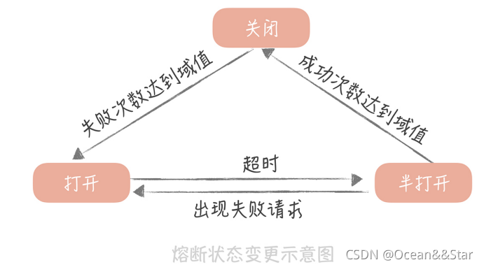

# 高并发系统设计：缓存、降级、限流、(熔断)

参考文章：https://blog.csdn.net/zhizhengguan/article/details/120814063

在开发高并发系统时有三把利器用来保护系统：==缓存、降级和限流==。

非核心服务可以采用**降级、熔断**，核心服务采用**缓存和限流**（隔离流量可以最大限度的保障业务无损）。

## **缓存**

缓存比较好理解，在大型高并发系统中，如果没有缓存数据库将分分钟被爆，系统也会瞬间瘫痪。使用缓存不单单能够提升系统访问速度、提高并发访问量，也是保护数据库、保护系统的有效方式。大型网站一般主要是“读”，缓存的使用很容易被想到。在大型“写”系统中，缓存也常常扮演者非常重要的角色。比如累积一些数据批量写入，内存里面的缓存队列（生产消费），以及HBase写数据的机制等等也都是通过缓存提升系统的吞吐量或者实现系统的保护措施。甚至消息中间件，你也可以认为是一种分布式的数据缓存。


## **降级**

服务降级是当服务器压力剧增的情况下，根据当前业务情况及流量对一些服务和页面有策略的降级，以此释放服务器资源以保证核心任务的正常运行。降级往往会指定不同的级别，面临不同的异常等级执行不同的处理。根据服务方式：可以拒接服务，可以延迟服务，也有时候可以随机服务。根据服务范围：可以砍掉某个功能，也可以砍掉某些模块。总之服务降级需要根据不同的业务需求采用不同的降级策略。主要的目的就是服务虽然有损但是总比没有好。


## **限流**

限流可以认为服务降级的一种，限流就是限制系统的输入和输出流量已达到保护系统的目的。一般来说系统的吞吐量是可以被测算的，为了保证系统的稳定运行，一旦达到的需要限制的阈值，就需要限制流量并采取一些措施以完成限制流量的目的。比如：延迟处理，拒绝处理，或者部分拒绝处理等等。

常见的限流算法有：计数器、漏桶和令牌桶算法。

[公众号文章-限流算法实践]: https://mp.weixin.qq.com/s/7zfdbf26aWX5Bma5F_lZAQ

### 1. 计数器

计数器是最简单粗暴的算法。比如某个服务最多只能每秒钟处理100个请求。我们可以设置一个1秒钟的滑动窗口，窗口中有10个格子，每个格子100毫秒，每100毫秒移动一次，每次移动都需要记录当前服务请求的次数。内存中需要保存10次的次数。可以用数据结构LinkedList来实现。格子每次移动的时候判断一次，当前访问次数和LinkedList中最后一个相差是否超过100，如果超过就需要限流了。

代码示例：

```java
//服务访问次数，可以放在Redis中，实现分布式系统的访问计数
Long counter = 0L;
//使用LinkedList来记录滑动窗口的10个格子。
LinkedList<Long> ll = new LinkedList<Long>();
public static void main(String[] args)
{
    Counter counter = new Counter();
    counter.doCheck();
}

private void doCheck()
{
    while (true)
    {
        ll.addLast(counter);
        if (ll.size() > 10)
        {
            ll.removeFirst();
        }
        //比较最后一个和第一个，两者相差一秒
        if ((ll.peekLast() - ll.peekFirst()) > 100)
        {
            //To limit rate
        }
        Thread.sleep(100);
    }
}
```

### 2. 漏桶算法

漏桶算法思路很简单，水（请求）先进入到漏桶里，漏桶以一定的速度出水，当水流入速度过大会直接溢出，可以看出漏桶算法能强行限制数据的传输速率。


### 3. 令牌桶算法


令牌桶算法的基本过程如下：

1. 假如用户配置的平均发送速率为r，则每隔1/r秒一个令牌被加入到桶中；
2. 假设桶最多可以存发b个令牌。如果令牌到达时令牌桶已经满了，那么这个令牌会被丢弃；
3. 当一个n个字节的数据包到达时，就从令牌桶中删除n个令牌，并且数据包被发送到网络；
4. 如果令牌桶中少于n个令牌，那么不会删除令牌，并且认为这个数据包在流量限制之外；
5. 算法允许最长b个字节的突发，但从长期运行结果看，数据包的速率被限制成常量r。

```text
对于在流量限制外的数据包可以以不同的方式处理：
它们可以被丢弃；
它们可以排放在队列中以便当令牌桶中累积了足够多的令牌时再传输；
它们可以继续发送，但需要做特殊标记，网络过载的时候将这些特殊标记的包丢弃。
```

> **漏桶和令牌桶的比较：**

令牌桶可以在运行时控制和调整数据处理的速率，处理某时的突发流量。放令牌的频率增加可以提升整体数据处理的速度，而通过每次获取令牌的个数增加或者放慢令牌的发放速度和降低整体数据处理速度。而漏桶不行，因为它的流出速率是固定的，程序处理速度也是固定的。整体而言，令牌桶算法更优，但是实现更为复杂一些。


## 熔断

熔断机制是应对雪崩效应的一种微服务链路保护机制，在互联网系统中当下游的服务因为某种原因突然变得不可用或响应过慢，上游服务为了保证自己整体服务的可用性，暂时不再继续调用目标服务，直接快速返回失败标志，快速释放资源。如果目标服务情况好转则恢复调用。

在这种模型下，服务调用方为每一个调用的服务维护一个有限状态机，在这个状态机会有三种状态：**关闭（调用远程服务）、半打开（尝试调用远程服务）和打开（返回错误）**。这三种状态之间切换的过程如下：

- 当调用失败的次数累积到一定的阈值时，熔断机制从关闭态切换到打开态。一般在实现时，如果调用成功一次，就会重置调用失败次数
- 当熔断处于打开状态时，我们会启动一个计时器，当计时器超时后，状态切换到半打开态。也可以通过设置一个定时器，定期的探测服务是否恢复
- 当熔断处于半打开状态时，请求可以达到后端服务，如果累计一定的成功次数后，状态切换到关闭态；如果出现调用失败的情况，则切换到打开态

