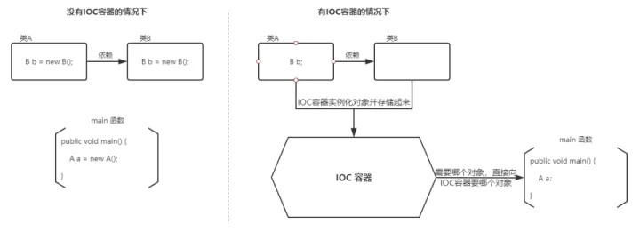

# Spring IOC 和 AOP

[TOC]

## 一、前言

Spring核心容器的主要组件是Bean工厂（BeanFactory），Bean工厂使用控制反转（IoC）模式来降低程序代码之间的耦合度，并提供了面向切面编程（AOP）的实现。

> 简单来说，Spring是一个轻量级的控制反转（IoC）和面向切面编程（AOP）的容器框架。

在具体介绍IoC和AOP之前，我们先简要说明下Spring常用注解

1、`@Controller`：用于标注控制器层组件

2、`@Service`：用于标注业务层组件

3、`@Component` : 用于标注这是一个受 Spring 管理的组件，组件引用名称是类名，第一个字母小写。可以使用@Component(“beanID”) 指定组件的名称

4、`@Repository`：用于标注数据访问组件，即DAO组件

5、`@Bean`：方法级别的注解，主要用在@Configuration和@Component注解的类里，@Bean注解的方法会产生一个Bean对象，该对象由Spring管理并放到IoC容器中。引用名称是方法名，也可以用@Bean(name = "beanID")指定组件名

6、`@Scope("prototype")`：将组件的范围设置为原型的（即多例）。保证每一个请求有一个单独的action来处理，避免action的线程问题。

由于Spring默认是单例的，只会创建一个action对象，每次访问都是同一个对象，容易产生并发问题，数据不安全。

7、`@Autowired`：默认按类型进行自动装配。在容器查找匹配的Bean，当有且仅有一个匹配的Bean时，Spring将其注入@Autowired标注的变量中。

8、`@Resource`：默认按名称进行自动装配，当找不到与名称匹配的Bean时会按类型装配。

- 简单点说，就是，能够明确该类是一个控制器类组件的，就用@Controller；
- 能够明确是一个服务类组件的，就用@Service；
- 能够明确该类是一个数据访问组件的，就用@Repository；
- 不知道他是啥或者不好区分他是啥，但是就是想让他动态装配的就用@Component。

@Controller、@Service、@Component、@Repository都是类级别的注解，如果一个方法也想动态装配，就用@Bean。

当我们想按类型进行自动装配时，就用@Autowired；当我们想按名称（beanID）进行自动装配时，就用@Resource；当我们需要根据比如配置信息等来动态装配不同的组件时，可以用getBean("beanID")。

## 二、 IoC和DI

### 什么是 IoC和DI？

**IOC（Inversion of Control）控制反转**

例如：现有类 A 依赖于类 B

- **传统的开发方式** ：往往是在类 A 中手动通过 new 关键字来 new 一个 B 的对象出来
- **使用 IoC 思想的开发方式** ：不通过 new 关键字来创建对象，而是通过 IoC 容器(Spring 框架) 来帮助我们实例化对象。我们需要哪个对象，直接从 IoC 容器里面过去即可。

*(1) 什么是控制反转呢？*

* 使用对象时，由主动new产生对象转换为由==外部==提供对象，此过程中对象创建控制权由程序转移到外部，此思想称为控制反转。
  * 业务层要用数据层的类对象，以前是自己`new`的
  * 现在自己不new了，交给`别人[外部]`来创建对象
  * `别人[外部]`就反转控制了数据层对象的创建权
  * 这种思想就是控制反转
  * 别人[外部]指定是什么呢?继续往下学

*(2) Spring和IOC之间的关系是什么呢?*

* Spring技术对IOC思想进行了实现
* Spring提供了一个容器，称为==IOC容器==，用来充当IOC思想中的"外部"
* IOC思想中的`别人[外部]`指的就是Spring的IOC容器

*(3) IOC容器的作用以及内部存放的是什么?*

* IOC容器负责对象的创建、初始化等一系列工作，其中包含了数据层和业务层的类对象
* 被创建或被管理的对象在IOC容器中统称为==Bean==
* IOC容器中放的就是一个个的Bean对象

*(4) 当IOC容器中创建好service和dao对象后，程序能正确执行么?*

* 不行，因为service运行需要依赖dao对象
* IOC容器中虽然有service和dao对象
* 但是service对象和dao对象没有任何关系
* 需要把dao对象交给service,也就是说要绑定service和dao对象之间的关系

像这种在容器中建立对象与对象之间的绑定关系就要用到DI:

**DI（Dependency Injection）依赖注入**


*(1) 什么是依赖注入呢?*

* 在容器中建立bean与bean之间的依赖关系的整个过程，称为依赖注入
  * 业务层要用数据层的类对象，以前是自己`new`的
  * 现在自己不new了，靠`别人[外部其实指的就是IOC容器]`来给注入进来
  * 这种思想就是依赖注入

*(2) IOC容器中哪些bean之间要建立依赖关系呢?*

* 这个需要程序员根据业务需求提前建立好关系，如业务层需要依赖数据层，service就要和dao建立依赖关系

### **为什么叫控制反转**

**控制** ：指的是对象创建（实例化、管理）的权力

**反转** ：控制权交给外部环境（Spring 框架、IoC 容器）




### 使用IoC：对象不用卡法这创建，而是交给Spring框架完成（基于XML和基于注解）

##### 基于XML：

开发者把需要创建的对象在XML中进行配置，Spring框架读取这个配置文件，根据配置文件的内容来创建对象

```xml
<?xml version="1.0" encoding="UTF-8"?>
<beans xmlns="http://www.springframework.org/schema/beans"
        xmlns:xsi="http://www.w3.org/2001/XMLSchema-instance"
        xmlns:context="http://www.springframework.org/schema/context"
        xmlns:aop="http://www.springframework.org/schema/aop"
        xmlns:p="http://www.springframework.org/schema/p"
        xsi:schemaLocation="http://www.springframework.org/schema/beans
        http://www.springframework.org/schema/beans/spring-beans.xsd
        http://www.springframework.org/schema/context
        http://www.springframework.org/schema/context/spring-context.xsd
        http://www.springframework.org/schema/aop
        http://www.springframework.org/schema/aop/spring-aop-4.3.xsd">
    <bean class="com.southwind.ioc.DataConfig" id="config">
        <property name="driverName" value="Driver"></property>
        <property name="url" value="localhost:8080"></property>
        <property name="username" value="root">
        </property>
        <property name="password" value="root">
        </property>
    </bean>
</beans>
```

```java
import org.springframework.context.ApplicationContext;
import org.springframework.context.support.ClassPathXmlApplicationContext;
public class Test {
    public static void main(String[] args) {
        // DataConfig dataConfig = new DataConfig();
        // dataConfig.setDriverName("Driver");
        //dataConfig.setUrl("localhost:3306/dbname");
        // dataConfig.setUsername("root");
        // dataConfig.setPassword("root");
        ApplicationContext context = new ClassPathXmlApplicationContext("spring.xml");
        System.out.println(context.getBean("config"));
    }
}
```

##### 基于注解：

1. 配置类（`@Configuration`）

用一个 Java 类来替代 XML 文件，把在 XML 中配置的内容放到配置类中。

```java
import com.southwind.ioc.DataConfig;
import org.springframework.context.annotation.Bean;
import org.springframework.context.annotation.Configuration;
@Configuration
public class BeanConfiguration {
    @Bean(value = "config")
    public DataConfig dataConfig(){
        DataConfig dataConfig = new DataConfig();
        dataConfig.setDriverName("Driver");
        dataConfig.setUrl("localhost:3306/dbname");
        dataConfig.setUsername("root");
        dataConfig.setPassword("root");
        return dataConfig;
    }
}
```

```java
ApplicationContext context = new AnnotationConfigApplicationContext(BeanConfiguration.class);
System.out.println(context.getBean("config"));
```

2. 扫包+配置

更简单的方式，不再需要依赖于 XML 或者配置类，而是直接将 bean 的创建交给目标类，在目标类添加注解来创建。

```java
import lombok.Data;
import org.springframework.beans.factory.annotation.Value;
import org.springframework.stereotype.Component;
@Data
@Component
public class DataConfig {
    @Value("localhost:3306")
    private String url;
    @Value("Driver")
    private String driverName;
    @Value("root")
    private String username;
    @Value("root")
    private String password;
}
```

```java
ApplicationContext context = new AnnotationConfigApplicationContext("com.southwi
nd.ioc");
System.out.println(context.getBean(DataConfig.class));
```

自动创建对象，完成依赖注入

```java
import lombok.Data;
import org.springframework.beans.factory.annotation.Autowired;
import org.springframework.beans.factory.annotation.Value;
import org.springframework.stereotype.Component;
@Data
@Component
public class GlobalConfig {
    @Value("8080")
    private String port;
    @Value("/")
    private String path;
    @Autowired
    private DataConfig dataConfig;
}
```

@Autowired 通过类型进行注入，如果需要通过名称取值，通过 @Qualifier 注解完成名称的映射

```java
import lombok.Data;
import org.springframework.beans.factory.annotation.Autowired;
import org.springframework.beans.factory.annotation.Qualifier;
import org.springframework.beans.factory.annotation.Value;
import org.springframework.stereotype.Component;
@Data
@Component
public class GlobalConfig {
    @Value("8080")
    private String port;
    @Value("/")
    private String path;
    @Autowired
    @Qualifier("config")
    private DataConfig dataConfig;
}
```

### IoC 解决了什么问题？

IoC 的思想就是两方之间不互相依赖，由第三方容器来管理相关资源。这样有什么好处呢？

1. 对象之间的耦合度或者说依赖程度降低；
2. 资源变的容易管理；比如你用 Spring 容器提供的话很容易就可以实现一个单例。

[知乎参考帖](https://zhuanlan.zhihu.com/p/141204279)

## 三、AOP

> AOP是面向切面编程，是一个设计思想，通过切面技术为业务主体增加额外的通知，从而对声明为切点的代码块进行统一管理和装饰。AOP是OOP的一种补充，利用AOP可以对业务逻辑的各个部分进行隔离，从而降低耦合度，提高程序的可重用性，同时也提高了开发效率。我们可以简单的把 AOP 理解为贯穿于方法之中，在方法执行前、执行时、执行后、返回值后、异常后要执行的操作。

### 什么是 AOP？

* AOP(Aspect Oriented Programming)面向切面编程，一种编程范式，指导开发者如何组织程序结构。
  * OOP(Object Oriented Programming)面向对象编程（我们都知道OOP是一种编程思想，那么AOP也是一种编程思想，编程思想主要的内容就是指导程序员该如何编写程序，所以它们两个是不同的`编程范式`。）

### AOP作用

- 作用:在不惊动原始设计的基础上为其进行功能增强，前面咱们有技术就可以实现这样的功能即*代理模式*。

**主要解决的问题是**：1. 打印日志 2. 事务 3. 权限处理

### AOP核心概念（来自黑马程序课程）

为了能更好的理解AOP的相关概念，我们准备了一个环境，整个环境的内容我们暂时可以不用关注，最主要的类为:`BookDaoImpl`

```java
@Repository
public class BookDaoImpl implements BookDao {
    public void save() {
        //记录程序当前执行执行（开始时间）
        Long startTime = System.currentTimeMillis();
        //业务执行万次
        for (int i = 0;i<10000;i++) {
            System.out.println("book dao save ...");
        }
        //记录程序当前执行时间（结束时间）
        Long endTime = System.currentTimeMillis();
        //计算时间差
        Long totalTime = endTime-startTime;
        //输出信息
        System.out.println("执行万次消耗时间：" + totalTime + "ms");
    }
    public void update(){
        System.out.println("book dao update ...");
    }
    public void delete(){
        System.out.println("book dao delete ...");
    }
    public void select(){
        System.out.println("book dao select ...");
    }
}
```

代码的内容相信大家都能够读懂，对于`save`方法中有计算万次执行消耗的时间。

当在App类中从容器中获取bookDao对象后，分别执行其`save`,`delete`,`update`和`select`方法后会有如下的打印结果:


这个时候，我们就应该有些疑问?

* 对于计算万次执行消耗的时间只有save方法有，为什么delete和update方法也会有呢?
* delete和update方法有，那什么select方法为什么又没有呢?

这个案例中其实就使用了Spring的AOP，在不惊动(改动)原有设计(代码)的前提下，想给谁添加功能就给谁添加。这个也就是Spring的理念：

* 无入侵式/无侵入式

说了这么多，Spring到底是如何实现的呢?


(1)前面一直在强调，Spring的AOP是对一个类的方法在不进行任何修改的前提下实现增强。对于上面的案例中BookServiceImpl中有`save`,`update`,`delete`和`select`方法,这些方法我们给起了一个名字叫==连接点==

(2)在BookServiceImpl的四个方法中，`update`和`delete`只有打印没有计算万次执行消耗时间，但是在运行的时候已经有该功能，那也就是说`update`和`delete`方法都已经被增强，所以对于需要增强的方法我们给起了一个名字叫==切入点==

(3)执行BookServiceImpl的update和delete方法的时候都被添加了一个计算万次执行消耗时间的功能，将这个功能抽取到一个方法中，换句话说就是存放共性功能的方法，我们给起了个名字叫==通知==

(4)通知是要增强的内容，会有多个，切入点是需要被增强的方法，也会有多个，那哪个切入点需要添加哪个通知，就需要提前将它们之间的关系描述清楚，那么对于通知和切入点之间的关系描述，我们给起了个名字叫==切面==

(5)通知是一个方法，方法不能独立存在需要被写在一个类中，这个类我们也给起了个名字叫==通知类==

至此AOP中的核心概念就已经介绍完了，总结下:

* 连接点(JoinPoint)：程序执行过程中的任意位置，粒度为执行方法、抛出异常、设置变量等
  * 在SpringAOP中，理解为方法的执行
* 切入点(Pointcut):匹配连接点的式子
  * 在SpringAOP中，一个切入点可以描述一个具体方法，也可也匹配多个方法
    * 一个具体的方法:如com.itheima.dao包下的BookDao接口中的无形参无返回值的save方法
    * 匹配多个方法:所有的save方法，所有的get开头的方法，所有以Dao结尾的接口中的任意方法，所有带有一个参数的方法
  * 连接点范围要比切入点范围大，是切入点的方法也一定是连接点，但是是连接点的方法就不一定要被增强，所以可能不是切入点。
* 通知(Advice):在切入点处执行的操作，也就是共性功能
  * 在SpringAOP中，功能最终以方法的形式呈现
* 通知类：定义通知的类
* 切面(Aspect):描述通知与切入点的对应关系。

### AOP 解决了什么问题？

通过上面的分析可以发现，AOP 主要用来解决：在不改变原有业务逻辑的情况下，增强横切逻辑代码，根本上解耦合，避免横切逻辑代码重复。

### AOP 为什么叫做切面编程？

**切** ：指的是横切逻辑，原有业务逻辑代码不动，只能操作横切逻辑代码，所以面向横切逻辑

**面** ：横切逻辑代码往往要影响的是很多个方法，每个方法如同一个点，多个点构成一个面。这里有一个面的概念

### 总结

AOP的知识就已经讲解完了，接下来对于AOP的知识进行一个总结:

#### 1 AOP的核心概念

* 概念：AOP(Aspect Oriented Programming)面向切面编程，一种编程范式
* 作用：在不惊动原始设计的基础上为方法进行功能==增强==
* 核心概念
  * 代理（Proxy）：SpringAOP的核心本质是采用代理模式实现的
  * 连接点（JoinPoint）：在SpringAOP中，理解为任意方法的执行
  * 切入点（Pointcut）：匹配连接点的式子，也是具有共性功能的方法描述
  * 通知（Advice）：若干个方法的共性功能，在切入点处执行，最终体现为一个方法
  * 切面（Aspect）：描述通知与切入点的对应关系
  * 目标对象（Target）：被代理的原始对象成为目标对象

#### 2 切入点表达式

* 切入点表达式标准格式：动作关键字(访问修饰符  返回值  包名.类/接口名.方法名（参数）异常名)

  ```
  execution(* com.itheima.service.*Service.*(..))
  ```

* 切入点表达式描述通配符：

  * 作用：用于快速描述，范围描述
  * `*`：匹配任意符号（常用）
  * `..` ：匹配多个连续的任意符号（常用）
  * `+`：匹配子类类型

* 切入点表达式书写技巧

  1.按==标准规范==开发
  2.查询操作的返回值建议使用\*匹配
  3.减少使用..的形式描述包
  4.==对接口进行描述==，使用\*表示模块名，例如UserService的匹配描述为*Service
  5.方法名书写保留动词，例如get，使用\*表示名词，例如getById匹配描述为getBy\*
  6.参数根据实际情况灵活调整

#### 3 五种通知类型

- 前置通知（@before）
- 后置通知（@after）
- 环绕通知（重点）（@arround）
  - 环绕通知依赖形参ProceedingJoinPoint才能实现对原始方法的调用
  - 环绕通知可以隔离原始方法的调用执行
  - 环绕通知返回值设置为Object类型
  - 环绕通知中可以对原始方法调用过程中出现的异常进行处理
- 返回后通知（@beforethrowing）
- 抛出异常后通知（@afterthrowing）

#### 4 通知中获取参数

- 获取切入点方法的参数，所有的通知类型都可以获取参数
  - JoinPoint：适用于前置、后置、返回后、抛出异常后通知
  - ProceedingJoinPoint：适用于环绕通知
- 获取切入点方法返回值，前置和抛出异常后通知是没有返回值，后置通知可有可无，所以不做研究
  - 返回后通知
  - 环绕通知
- 获取切入点方法运行异常信息，前置和返回后通知是不会有，后置通知可有可无，所以不做研究
  - 抛出异常后通知
  - 环绕通知
