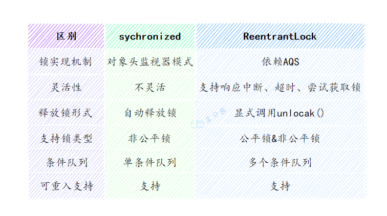
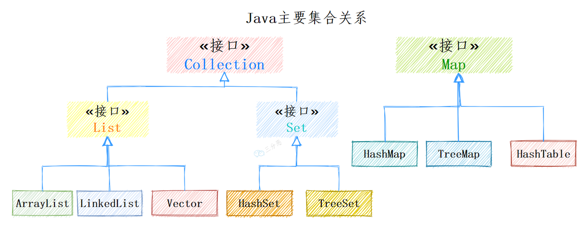

# 网易实习-后台开发-面经

有一些问题没有回答，是因为这部分面试题还没有系统去复习，之后会补充进去。

## 1.java提供了哪些线程池。如何实现自己线程池。

### Java提供了以下几种线程池：

1. FixedThreadPool：**固定线程数量的线程池**，当有新任务提交时，若当前线程池正在执行任务，则将新任务加入到等待队列中。
2. CachedThreadPool：**可缓存线程的线程池**，适用于执行大量的短期异步任务，线程池的数量可以根据需要自动扩大或缩小。
3. ScheduledThreadPool：**定时任务线程池**，可以定时执行任务或者周期性执行任务。
4. SingleThreadExecutor：**单线程的线程池**，只会创建一个线程来执行任务，适用于需要顺序执行任务的场景。
5. WorkStealingPool：**工作窃取线程池**，适用于CPU密集型的任务，线程池中的线程可以窃取其他线程队列中的任务执行。

### 如何实现自己的线程池？

要实现自己的线程池，你需要完成以下几个步骤：

1. 定义一个任务队列：用于存放等待执行的任务。

2. 定义一个线程池管理器：用于管理线程池中的线程，比如启动、关闭等操作。

3. 定义一个工作线程：用于执行任务，从任务队列中取出任务并执行。

4. 创建线程池：初始化线程池，指定线程数量、任务队列大小等参数。

5. 提交任务：将任务提交到任务队列中。

   https://mp.weixin.qq.com/s/Exy7pRGND9TCjRd9TZK4jg

## 2.ReentrantLock和synchronized的区别，ReentrantLock相比synchronized有哪些有点，从接口的层面讲

可以从锁的实现、功能特点、性能等几个维度去回答这个问题：

- **锁的实现：** synchronized是Java语言的关键字，基于JVM实现。而ReentrantLock是基于JDK的API层面实现的（一般是lock()和unlock()方法配合try/finally 语句块来完成。）
- **性能：** 在JDK1.6锁优化以前，synchronized的性能比ReenTrantLock差很多。但是JDK6开始，增加了适应性自旋、锁消除等，两者性能就差不多了。
- **功能特点：** ReentrantLock 比 synchronized 增加了一些高级功能，如等待可中断、可实现公平锁、可实现选择性通知。
  - ReentrantLock提供了一种能够中断等待锁的线程的机制，通过lock.lockInterruptibly()来实现这个机制
  - ReentrantLock可以指定是公平锁还是非公平锁。而synchronized只能是非公平锁。所谓的公平锁就是先等待的线程先获得锁。
  - synchronized与wait()和notify()/notifyAll()方法结合实现等待/通知机制，ReentrantLock类借助Condition接口与newCondition()方法实现。
  - ReentrantLock需要手工声明来加锁和释放锁，一般跟finally配合释放锁。而synchronized不用手动释放锁。

下面的表格列出出了两种锁之间的区别：



## 3.aop的原理，spring的事务。类的私有方法可以实现事务吗？为什么？

AOP面向切面编程，将一些业务逻辑相同的代码抽取到一个独立的模块中，实现对业务逻辑的隔离。常用的就是日志记录和数据校验。

spring事务支持编程式事务管理和声明式事务管理两种方式。

事务的四个特征就是ACID（原子性、一致性、隔离性、持久性）。

类的私有方法可以实现事务，主要是因为事务并不是一个特定的概念，而是一种设计模式。在实现事务时，需要满足以下条件：

1. 事务必须是原子性的，即要么全部成功，要么全部失败。这可以通过在一个方法中执行一系列操作来实现。
2. 事务必须是一致性的，即在事务开始前和结束后，数据必须保持一致。这可以通过在事务方法中使用数据库事务控制语句（如BEGIN、COMMIT、ROLLBACK）来实现。
3. 事务必须是隔离性的，即事务之间相互隔离，互不干扰。这可以通过在事务方法中使用同步机制或者使用数据库管理系统的事务隔离级别来实现。

类的私有方法可以实现这些条件，因为私有方法只能在当前类中被调用，保证了事务方法的封装性和独立性。此外，私有方法可以访问类的私有变量，可以在方法中对变量进行修改，从而实现事务的一致性。但需要注意的是，实现事务还需要考虑多线程并发操作、异常处理等问题，因此建议使用成熟的事务框架来实现事务。

## 4.java的集合类都有哪些（list，set，map）?都有哪些实现类，相互之间都有哪些区别。



Java的集合类主要分为两种类型：一种是基于接口的集合类，另一种是实现类。基于接口的集合类是一组接口，它们定义了不同类型的集合的通用行为，例如添加、删除、查找元素等。实现类则是这些接口的具体实现，提供了不同类型的集合的具体实现方法。

## 5.map的三种实现类的区别

HashMap、TreeMap、HashTable

HashTable、TreeMap、HashMap 都是 Java 集合框架中常见的映射表（Map）实现，它们有以下几点区别：

1. 底层数据结构：HashTable 和 HashMap 底层采用的是**数组+链表/红黑树**的结构，而 TreeMap 底层采用的是**红黑树结构**，因此 TreeMap 是一种基于红黑树实现的有序映射表。
2. 线程安全性：HashTable 是线程安全的，而 HashMap 和 TreeMap 都是非线程安全的。如果需要在多线程环境下使用 Map，可以使用 ConcurrentHashMap 替代 HashMap，或者使用 Collections.synchronizedMap 方法将 HashMap 转换为线程安全的实现。
3. 顺序性：HashMap 是无序的，而 TreeMap 是有序的。在 TreeMap 中，元素按照键的自然顺序或者通过 Comparator 接口指定的顺序进行排序。
4. 可空性：HashTable 和 TreeMap 不允许键或值为 null，而 HashMap 允许键或值为 null。
5. 性能：HashMap 的性能比 HashTable 好，因为 HashMap 的实现使用了更先进的哈希算法，同时 HashMap 不需要进行同步，因此在单线程环境下性能更好。TreeMap 的性能比 HashMap 和 HashTable 稍差，因为它的底层结构是红黑树，而红黑树的插入和查找操作都比哈希表复杂。

综上所述，HashTable、TreeMap、HashMap 有着不同的特点和适用场景，需要根据实际需求来选择适当的实现类。如果需要线程安全的实现，可以选择 HashTable 或者 ConcurrentHashMap；如果需要有序的映射表，可以选择 TreeMap；如果需要高性能的实现，可以选择 HashMap。

## 6.concurrentHashMap底层实现和hashtable的区别

concurrentHashMap 是Java并发包提供的线程安全的哈希表，允许多个线程写入和读取，其底层实现主要包括以下几个方面：

1. 分段锁：ConcurrentHashMap 内部维护了多个 Segment（段）,每个 Segment 是一个类似于 HashMap 的结构，它拥有独立的锁，这样不同的线程可以同时访问不同的 Segment，从而提高并发度。
2. 数据结构：每个 Segment 内部是一个 HashEntry 数组，每个 HashEntry 是一个链表的头结点，它可以指向多个链表节点，每个节点包括键值对等信息。
3. 安全性：ConcurrentHashMap 的 put、get、remove 等操作是线程安全的，它们都使用了适当的锁来保证线程安全，同时使用了 volatile 等机制来保证可见性和内存一致性。
4. 扩容：ConcurrentHashMap 的扩容和普通的 HashMap 不同，它只会对某个 Segment 进行扩容，而不是对整个 HashMap 进行扩容，这样可以避免在扩容时锁住整个 ConcurrentHashMap。
5. 计算哈希值：ConcurrentHashMap 的哈希值计算方式和 HashMap 不同，它使用了 Java 7 的 ConcurrentHashMap 在计算哈希值时引入了一个“位运算”+“乘数”+“异或运算”的混合方式，可以有效地减少哈希冲突的概率。

总的来说，ConcurrentHashMap 通过分段锁的方式，保证了线程安全，同时使用哈希表和链表的结构，提供了高效的查找和插入操作。虽然它的底层实现比 HashMap 复杂，但是在高并发环境下，它可以提供更好的性能和可靠性。

## 7.vector可以用在高并发场景吗？高并发场景用什么？

虽然 Vector 是一种线程安全的动态数组，但是在高并发场景下，不建议使用 Vector，因为它的同步机制会导致多个线程竞争同一个锁，从而降低并发性能。

在 Java 中，有一些更加适合高并发场景的集合类，例如 CopyOnWriteArrayList 和 ConcurrentHashMap。CopyOnWriteArrayList 是一种线程安全的动态数组，它使用了一种写时复制的策略，可以在保证线程安全的前提下提高并发性能。ConcurrentHashMap 是一种线程安全的哈希表，它采用了分段锁的机制，可以实现更好的并发性能。

因此，在高并发场景下，建议使用 CopyOnWriteArrayList 或 ConcurrentHashMap 等更加适合并发环境的集合类，而不是使用 Vector。

## 8.kafka的作用

## 9.有一个存储string的list，如何遍历删除其中指定的字符串。

使用迭代器Iterator遍历List、然后使用remove方法移除指定的字符串

## 10.java原子类使用和实现原理

Java从JDK 1.5开始提供了java.util.concurrent.atomic包，这个包中的原子操作类提供了一种用法简单、性能高效、线程安全地更新一个变量的方式。

## 11.不用concurrentHashMap如何获取一个线程安全的hashmap

Collections.synchronizedList方法将其转化成线程安全的实现

## 12.数据库的隔离级别有哪些种。数据库有锁吗？如何实现的

- 读未提交（Read Uncommitted）
- 读已提交（Read Committed）
- 可重复读（Repeatable Read）
- 串行化（Serializable）

## 13.现在有很多数据（用户的订单交易数据）需要加载带内存中（不用考虑内存是否足够），使用什么数据结构来实现快速查找某一时间段的用户交易数据。

红黑树。可以将时间戳作为键值，将用户订单交易数据作为值，然后将这些键值对存储在 TreeMap 中，就可以快速地查找某一时间段的用户交易数据了。

```java
TreeMap<Long, List<Transaction>> data = new TreeMap<>();

// 插入数据
public void insert(long timestamp, Transaction transaction) {
    List<Transaction> transactions = data.get(timestamp);
    if (transactions == null) {
        transactions = new ArrayList<>();
        data.put(timestamp, transactions);
    }
    transactions.add(transaction);
}

// 查找数据
public List<Transaction> query(long startTime, long endTime) {
    return data.subMap(startTime, true, endTime, true).values().stream()
            .flatMap(List::stream)
            .collect(Collectors.toList());
}

```


## 14.netty是什么？netty可以干什么?有哪些优点?

## 15.spring ioc是干嘛的？spring中所有的实例都是单例的吗？如何实现获取同一个类的两个实例?

在Spring框架中，默认情况下，所有的Bean都是单例的，也就是说在整个应用程序中只存在一个实例。这是因为Spring的Bean容器在初始化Bean时默认采用了单例模式。

采用单例模式的优点是可以减少对象的创建和销毁，提高系统性能和效率。但是也需要注意单例模式所带来的一些问题，如线程安全性、对象的状态共享等问题。

除了单例模式，Spring框架还支持以下两种模式：

1.原型模式（Prototype）：每次获取Bean时都会创建一个新的实例。

2.会话模式（Session）：在Web应用程序中，每个HTTP Session中只存在一个实例，不同的HTTP Session中的实例不同。

可以通过在Bean的配置中设置scope属性来指定Bean的模式。默认情况下，scope属性的值为singleton，即单例模式。如果要指定原型模式，则需要将scope属性的值设置为prototype。如果要指定会话模式，则需要将scope属性的值设置为session。

## 16.有一个数据量增长很快的表，如何设计可以提高查询速度。

1. 合理的索引设计
2. 分库分表
3. 数据冗余和缓存：对于一些频繁查询但不经常变化的数据，可以将其冗余到其他表中或者缓存中
4. 避免全表扫描，可以通过优化查询条件或者增加索引来避免全表扫描

## 17.nginx是干什么的，cdn是干嘛的，说一说你知道的对称加密算法。

## 18.不用迭代器如何实现list列表去除指定的元素。

可以使用Java 8中的Stream API来实现对List列表去除指定的元素，不需要使用迭代器，具体代码如下：

```java
list.removeIf(e -> e.equals("指定的元素"));
```

上述代码中，`removeIf`方法接收一个Predicate对象作为参数，用于判断列表中的每个元素是否需要删除。通过lambda表达式，可以快速实现对指定元素的过滤，符合条件的元素将被删除。

需要注意的是，使用`removeIf`方法会直接修改原有的List列表，因此需要谨慎使用。如果需要保留原有列表并生成一个新的列表，可以使用`filter`方法来实现。

## 19.场景设计题：用户购买了某一些股票，我们如何设计一个当股票上涨一定的幅度之后给用户推送提醒。（股票数据每一分钟，都在变化，即相当于每一秒都给你发送很多数据，然后进行处理实现推送逻辑）

## 20.编程题：有一个文件每一行有四列数据用"|"分割，第一列是账号，第二列是性别，第三列是年龄，第四列是省份。第二行和第三行可以唯恐。实习统计每个省份注册的账号的数量，并按照降序排列输出。